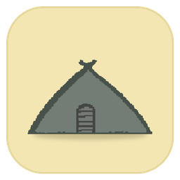

<p align="center"></p>

<h1 align="center">bunker</h1>

<p align="center">A fast GTK4 terminal for Linux, with <a href="https://github.com/jsnjack/bunk">bunk</a> built in.</p>

> bunker is built on **[bunk](https://github.com/jsnjack/bunk) by
> [jsnjack](https://github.com/jsnjack)**: panes, the terminal emulator,
> scrollback, search, and everything that makes Claude Code, vim, and btop
> render correctly come from bunk. bunker adds a native window around it.
>
> Want these features in the terminal you already use? Use
> [bunk](https://github.com/jsnjack/bunk).

## What you get

- **bunk in every tab:** split panes, context-aware splits into the same
  container / SSH host / sudo, zoom, search, status badges
- **Tabs** in a sidebar (collapsible) or a bar, renamable, coloured by the theme
- **20 themes**, following your desktop's light/dark by default (`bunker themes`)
- **GPU rendering**, one Go binary, no Electron
- **Preferences** (Ctrl+,) that edit a plain config file; editor changes apply live
- **Clickable links:** Ctrl+click URLs and `ls --hyperlink` links
- **Input methods:** dead keys, Compose, CJK, emoji picker

## Install

bunker is released as an RPM for Fedora 43 and later. It installs the
program, its launcher, and its icons, and pulls in GTK 4:

```bash
grm install Vamxi/bunker
```

The RPM from the [releases page](https://github.com/Vamxi/bunker/releases)
also installs with `sudo dnf install ./bunker-*.rpm`.

To build from source instead: `sudo dnf install gtk4-devel && make install`
(the first build takes a few minutes).

## Keys

| Key | Action |
|---|---|
| `F1` / `Alt+F1` | Split / split into the same container, SSH host, or sudo |
| `F12` | Zoom the pane |
| `Alt+←↑→↓` | Move between panes |
| `Ctrl+F` | Search |
| `Ctrl+C` / `Ctrl+V` | Copy selection (otherwise sent to the program) / paste |
| `Shift+PgUp` / `Shift+PgDn` | Scroll history |
| `Ctrl+F12` | Send every key to the program (passthrough) |
| `Ctrl+Shift+T` / `Ctrl+Shift+W` | New tab / close tab |
| `Ctrl+PgUp` / `Ctrl+PgDn` | Previous / next tab |
| `Ctrl+,` | Preferences |

Right-click a tab to rename or close it. Every shortcut can be changed in
Preferences > Keyboard, under `[keys]` in the config, or from a shell.

## Configuration

`~/.config/bunker/config.toml`. Run `bunker config init` for a documented
default, or use Preferences.

Coming from bunk? Your config works as-is:
`cp ~/.config/bunk/config.toml ~/.config/bunker/`

```toml
theme = "system"             # follows the desktop; or dark-pastel, nord, ...
font  = "JetBrains Mono 12"

[tabs]
position  = "left"           # left, right, top, bottom
collapsed = false

[cursor]
blink = "off"                # system, on, off

[keys]
new_tab  = "f2"
next_tab = "ctrl+right"
prev_tab = "ctrl+left"
```

The same settings from a shell, for scripts and dotfiles:

```bash
bunker config set cursor.blink off
bunker config set keys.new_tab f2
bunker config set keys.next_tab '<Control>Right'   # GTK spelling works too
bunker config list                                   # every setting and its value
```

A running bunker applies changes at once. If two actions end up with the
same key, bunker says so in a banner.

## More

- `bunker -- btop` runs a program instead of your shell
- [CHANGELOG.md](CHANGELOG.md): what each release brings
- [TESTING.md](TESTING.md): tests, benchmarks, and how not to regress
